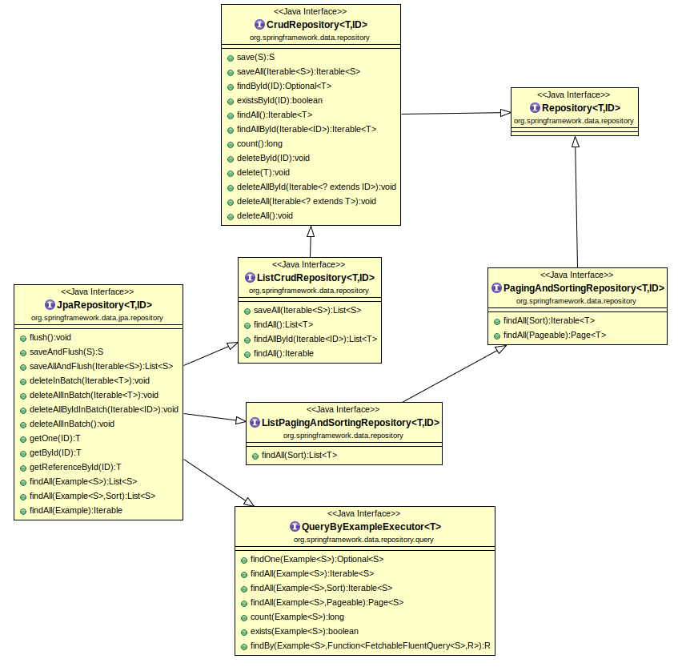

# 01. Spring JPA 사용하기

## 01-1. JPA(Java Persistence API)란?

Spring Boot에서 JPA는 Java 언어의 장점을 활용하여 SQL 명령문이 없이 데이터베이스를 운영할 수 있도록 하는 것에 방점이 있다. 이렇듯이 데이터베이스의 운영시스템에서 직접 해당 테이블의 관계를 설정하는 것이 아니라 자바 클래스의 관계를 설정하므로써 실제 데이터베이스에 적용될 때는 그에 맞는 SQL명령으로 전환되어 처리될 수 있도록 한 ORM(Object-Relational Mapping)의 한 방법이다.

실제로 적용가능하며, 자바 클래스로 부터 유도된 객체가 생성(save), 수정(modify), 조회(findBy), 제거(remove) 되면, 하나의 개체(Entity)가 똑같이 설정한 관계(Relationship)에 의해 참조되고, 동작이 이루어져 데이터베이스에 적용될 것이다.

<br><hr><br>

### 01-1-1. 의존성 라이브러리 등록

build.gradle 작성

```groovy
plugins {
	id 'java'
	id 'war'
	id 'org.springframework.boot' version '3.1.6'
	id 'io.spring.dependency-management' version '1.1.4'
}

group = 'com'
version = '0.0.1-SNAPSHOT'

java {
	sourceCompatibility = '17'
}

configurations {
	compileOnly {
		extendsFrom annotationProcessor
	}
}

repositories {
	mavenCentral()
}

dependencies {
	implementation 'org.springframework.boot:spring-boot-starter-data-jpa'
	implementation 'org.springframework.boot:spring-boot-starter-web'
	implementation 'org.springframework.boot:spring-boot-starter-thymeleaf'
	implementation 'org.modelmapper:modelmapper:3.1.0'
	implementation 'nz.net.ultraq.thymeleaf:thymeleaf-layout-dialect:3.1.0'
	implementation 'com.querydsl:querydsl-jpa:5.0.0:jakarta'			//QueryDSL 추가1
	implementation 'com.querydsl:querydsl-apt:5.0.0:jakarta'			//QueryDSL 추가2
	compileOnly 'org.projectlombok:lombok'
	developmentOnly 'org.springframework.boot:spring-boot-devtools'
	runtimeOnly 'org.mariadb.jdbc:mariadb-java-client'
	annotationProcessor 'org.springframework.boot:spring-boot-configuration-processor'	//설정 작업시 필요한 속성과 지정 가능한 값들과 메소드를 표시해주므로써 쉽게 작성할 수 있도록 도움을 줌
	annotationProcessor 'org.projectlombok:lombok'
	annotationProcessor 'jakarta.persistence:jakarta.persistence-api:3.1.0'		//QueryDSL 추가3
	annotationProcessor 'jakarta.annotation:jakarta.annotation-api:2.1.1'		//QueryDSL 추가4
	annotationProcessor 'com.querydsl:querydsl-apt:5.0.0:jakarta'			//QueryDSL 추가5
	providedRuntime 'org.springframework.boot:spring-boot-starter-tomcat'
	testImplementation 'org.springframework.boot:spring-boot-starter-test'
	testAnnotationProcessor 'org.projectlombok:lombok'	/* Test 에서 Slf4j 또는 Log4j2 사용1 */
	testCompileOnly 'org.projectlombok:lombok' /* Test 에서 Slf4j 또는 Log4j2 사용2 */
}

tasks.named('bootBuildImage') {
	builder = 'paketobuildpacks/builder-jammy-base:latest'
}

tasks.named('test') {
	useJUnitPlatform()
}
```

<br>

### 01-1-2. 애플리케이션 환경 변수 설정

application.properties

```properties
server.port=8087

logging.level.org.springframework=info
logging.level.com.datajpa=info

spring.datasource.driver-class-name=org.mariadb.jdbc.Driver
spring.datasource.url=jdbc:mariadb://localhost:3306/edutech
spring.datasource.username=root
spring.datasource.password=1234

spring.jpa.show-sql=true
spring.jpa.hibernate.ddl-auto=update
```

<br><hr><br>


## 01-2. 애플리케이션 설정에서 모델매핑(ModelMapping) 하기

- DTO 를 Entity로 Entity를 DTO로 매핑 변환을 위한 Model Mapper

Spring Boot JPA에서는 DTO의 형태로 클라이언트와 서버 간의 데이터를 송수신하여야 하고, 
데이터베이스 시스템에 데이터가 저장되고, 운영되기 위해서는 Entity의 형태로 활용이 될 수 있도록 설계되었다.
그렇다면, DTO에서 Entity로 Entity에서 DTO의 형태로 변환이 필요한데 이러한 객체 변환을 할 수 있도록 해주는 라이브러리가 ModelMapper이다.
혹여, 클라이언트와도 데이터베이스 시스템과도 Entity 만 활용하여 시스템을 가용시킨다면, 어떠한 위험이 초래될까?
그것은 아주 심각한 위험을 초래한다.
첫 번째, 클라이언트의 요청 URL과 데이터를 브라우저에 입력하여 요청이 들어온다면, 데이터베이스와 직접 연결되어 뚫리게 되며, 자바 클래스를 쓰는 이유인 정보은닉의 장점이 사라져 버리고, 그대로 데이터 테이블의 모든 정보를 고스란히 가져다 바치는 원흉이 된다.
두 번째, 클라이언트가 요청한 데이터를 처리하기 위하여 여러 번 시도하게 되거나 클라이언트가 이미 처리한 일을 계속 요구하게 되면, 불필요한 데이터이 중복 데이터가 수도 없이 많이 발생하여 데이터베이스가 몇 개의 데이터로 꽉 차게 되어 버린다.
세 번째, 불법적인 방법의 접근으로 데이터베이스 시스템에 접근하여 데이터를 전부 또는 일부를 가져가고, 엉뚱한 데이터를 남기고 떠나게 된다면 큰 범죄에 노출될 수 밖에 없다.
네 번째, 설계 상의 불필요하거나 존재하지 말아야 할 데이터가 존재할 수 밖에 없게 되며, 자칫 매크로 코드가 데이터베이스에 남게 된다면, 범죄의 소굴로 악용될 수 밖에 없다.

<br>

종합해보면, Entity를 직접 클라이언트가 활용되게 된다면, JPA를 쓸 이유도 없어지며, Entity 클래스의 사용하는 이유인 중요성과 민감성, 정보의 보안성이 모두 무너져 버린다. 반드시 Model에 대한 Mapping 또는 Swiching이 되어 시스템에 적용될 수 있도록 해야하며, 이는 Backend에서 사용할 자바 클래스와 Frontend에서 사용할 자바 클래스를 분리하여 결합도는 줄이고, 응집도는 높이는 방향성을 가져야 한다.


<br><br>

### 01-2-1. 모델매퍼(ModelMapper)

ModelMapper : 객체의 프로퍼티를 다른 객체의 프로퍼티로 맵핑해주는 라이브러리

MapStruct : ModelMapper를 활용하게 되면, 일일이 서비스에서 매핑(Mapping)을 시키는 매퍼(Mapper) 클래스를 만들어야 하므로 비효율적이다. 
도메인이나 엔티티가 늘어날 때마다 자동으로 Mapper 구현 클래스를 자동으로 생성해주는 코드 자동 생성 라이브러리

※ 모델매핑(ModelMapping)을 하기 위해서는 우선 모델매퍼(ModelMapper)를 빈(@Bean)으로 등록하고, 서비스와 같은 비즈니스 처리 로직부에서 매핑을 해주면 된다.

<br>

#### ModelMapper 빈 등록

```java
package com.datajpa.config;

import org.modelmapper.ModelMapper;
import org.modelmapper.convention.MatchingStrategies;
import org.springframework.context.annotation.Bean;
import org.springframework.context.annotation.Configuration;
import org.springframework.data.jpa.repository.config.EnableJpaAuditing;

@Configuration
@EnableJpaAuditing
public class MvcConfig {
    @Bean
    public ModelMapper modelMapper() {
        ModelMapper modelMapper = new ModelMapper();
        return modelMapper;
    }
}
```

<br>

#### ModelMapper의 빈 등록시 여러 매핑 설정 변수 - 기본 설정


| 변수 세팅 메소드 | 설명 | 적용가능한 상수 또는 값 |
|----------------|--------------------------------------|-----------------|
| setAmbiguityIgnored(논리값) | 둘 이상의 source 속성과 일치하는 destination 속성을 무시해야 하는지 여부를 결정합니다. | false, true |
| AccessLevel.열거형상수 | 접근성을 기준으로 일치에 적합한 메서드와 필드를 결정합니다. | PUBLIC, PROTECTED, <br>PRIVATE, PACKAGE_PRIVATE |
| setCollectionsMergeEnabled(논리값) | source와 destination의 크기가 다른 경우 대상 항목을 교체하거나 병합해야 하는지 여부를 결정합니다. | true, false |
| setFieldMatchingEnabled(논리값) | source 속성과 destination 속성이 일치해야하는지의 여부를 설정합니다. | true, false |
| setSourceNamingConvention(자바빈즈명)<br>setDestinationNamingConvention(자바빈즈명) | 이름을 기준으로 일치에 적합한 메서드와 필드를 결정합니다. | JavaBeans |
| setFullTypeMatchingRequired(논리값)  | ConditionalConverters가 적용되기 위해 전체 일치를 정의해야 하는지 여부를 결정합니다. | false, true |  
| setImplicitMappingEnabled(논리값)  | 암시적 매핑을 활성화해야 하는지 여부를 결정합니다.  | true, false |
| setSourceNameTransformer(자바빈즈명)<br>setDestinationNameTransformer(자바빈즈명) | 토큰화 하기 전에 적합한 속성 및 클래스 이름을 변환합니다. | JavaBeans |
| setSourceNameTokenizer(NameTokenizers.열거형상수)<br>setDestinationNameTokenizer(NameTokenizers.열거형상수) | 토큰화 하기 전에 적합한 속성 및 클래스 이름을 변환합니다. | CAMEL_CASE, UNDERSCORE  |
| setMatchingStrategy(MatchingStrategies.열거형) | source 및 destination 토큰이 일치하는 방법을 지정합니다. | STANDARD, STRICT, LOOSE |
| setPreferNestedProperties(논리값) | 암시적 매핑이 중첩 속성을 매핑해야 하는지 결정합니다. | true, false |
| setSkipNullEnabled(논리값) | 속성 값이 null인 경우 속성을 건너뛰어야 하는지 여부를 결정합니다. | false, true |

※ source는 Entity를 말하며, destination는 DTO와 같은 것을 말함.

※ Entity는 Backend의 클래스이며, DTO는 Frontend의 클래스임.


```java
package com.datajpa.config;

import org.modelmapper.ModelMapper;
import org.modelmapper.convention.MatchingStrategies;
import org.springframework.context.annotation.Bean;
import org.springframework.context.annotation.Configuration;
import org.springframework.data.jpa.repository.config.EnableJpaAuditing;

@Configuration
@EnableJpaAuditing
public class MvcConfig {
    @Bean
    public ModelMapper modelMapper() {
        ModelMapper modelMapper = new ModelMapper();
        modelMapper.getConfiguration()
                .setFieldAccessLevel(org.modelmapper.config.Configuration.AccessLevel.PRIVATE)
                .setFieldMatchingEnabled(true)
                .setMatchingStrategy(MatchingStrategies.STRICT);
        return modelMapper;
    }
}
```

<br>

#### ModelMapper의 매핑 전략 설정

[매핑 전략 문서](https://modelmapper.org/user-manual/configuration/#matching-strategies "Matching Strategies")

- STRICT : source의 속성과 destination 속성의 이름과 형식이 정확히 일치할 때만 매핑

- STANDARD : 모든 source 속성의 이름은 하나 이상 일치하고, destination 속성의 이름은 모두 일치될 때만 매핑

- LOOSE : 마지막 detination 속성의 이름이 모든 토큰이 일치해야 하고, 마지막 source 속성의 이름은 일치하는 토큰이 하나 이상이 있을 때 매핑

```java
package com.datajpa.config;

import org.modelmapper.ModelMapper;
import org.modelmapper.convention.MatchingStrategies;
import org.springframework.context.annotation.Bean;
import org.springframework.context.annotation.Configuration;
import org.springframework.data.jpa.repository.config.EnableJpaAuditing;

@Configuration
@EnableJpaAuditing
public class ModelMappingConfig {
	private final ModelMapper modelMapper = new ModelMapper();

    @Bean
    public ModelMapper strictMapper() {	//연관 관계가 엄격히 지켜지는 지능적 매핑 전략
        modelMapper.getConfiguration()
                .setMatchingStrategy(MatchingStrategies.STRICT);
        return modelMapper;
    }

	@Bean
    public ModelMapper standardMapper() {	//연관 관계가 표준으로 정해진 부분 즉, 필드명이 정확히 일치하는 필드만 매핑하는 전략
    	modelMapper.getConfiguration()
    			.setMatchingStrategy(MatchingStrategies.STANDARD);
    	return modelMapper;
    }

	@Bean
    public ModelMapper looseMapper() {	//연관 관계가 거의 지켜지지 않는 수준의 매핑 전략
    	modelMapper.getConfiguration()
    			.setMatchingStrategy(MatchingStrategies.LOOSE);
    	return modelMapper;
    }
}
```

<br>

#### source의 속성의 이름과 destination의 속성의 이름이 다를 경우의 토크나이저(Tokenizer) 설정

```java
package com.datajpa.config;

import org.modelmapper.ModelMapper;
import org.modelmapper.convention.MatchingStrategies;
import org.springframework.context.annotation.Bean;
import org.springframework.context.annotation.Configuration;
import org.springframework.data.jpa.repository.config.EnableJpaAuditing;

@Configuration
@EnableJpaAuditing
public class MapperTokenizerConfig {

    @Bean
    public ModelMapper tokenizerMapper() {	
		ModelMapper modelMapper = new ModelMapper();
        modelMapper.getConfiguration()
           .setSourceNameTokenizer(NameTokenizers.CAMEL_CASE)
           .setDestinationNameTokenizer(NameTokenizers.UNDERSCORE);
        return modelMapper;
    }
}
```

<br>

#### source 속성의 이름과 destination 속성의 이름을 직접 매핑해야 하는 경우의 설정

```java
package com.datajpa.config;

import org.modelmapper.ModelMapper;
import org.modelmapper.convention.MatchingStrategies;
import org.springframework.context.annotation.Bean;
import org.springframework.context.annotation.Configuration;
import org.springframework.data.jpa.repository.config.EnableJpaAuditing;

@Configuration
@EnableJpaAuditing
public class DirectMappingConfig {

    @Bean
    public ModelMapper tokenizerMapper() {	
		ModelMapper modelMapper = new ModelMapper(); 
        return modelMapper;
    }
}
```

<br>

```java
package com.datajpa.service;

import com.datajpa.dto.TestDto;
import com.datajpa.entity.Test;
import com.datajpa.repository.TestRepository;
import lombok.extern.slf4j.Slf4j;
import lombok.RequiredArgsConstructor;
import org.modelmapper.ModelMapper;
import org.springframework.stereotype.Service;
import org.springframework.transaction.annotation.Transactional;

import java.util.List;
import java.util.Optional;
import java.util.stream.Collectors;

@Service
@RequiredArgsConstructor
@Slf4j
@Transactional
public class TestServiceImpl implements TestService {

    private final TestRepository testRepository;
    private final ModelMapper modelMapper;

    @Override
    public TestDto getTest(String name, Long id) {
        Test test = testRepository.getTest1(number);
		modelMapper.createTypeMap(Test.class, TestDTO.class)
			.addMapping(Test::getName, TestDTO::setUserName)
            .addMapping(Test::getId, TestDTO::setAccountId)  
        ProductDto res = modelMapper.map(test, TestDto.class);
        return res;
    }
}
```

<br>

#### 특정 필드 매핑시 Null일 경우 자동 Skip 설정

```java
package com.datajpa.config;

import org.modelmapper.ModelMapper;
import org.modelmapper.convention.MatchingStrategies;
import org.springframework.context.annotation.Bean;
import org.springframework.context.annotation.Configuration;
import org.springframework.data.jpa.repository.config.EnableJpaAuditing;

@Configuration
@EnableJpaAuditing
public class NullSkipMappingConfig {

    @Bean
    public ModelMapper tokenizerMapper() {	
		ModelMapper modelMapper = new ModelMapper();
		modelMapper.getConfiguration().setSkipNullEnabled(true);  
        return modelMapper;
    }
}
```

<br>

```java
package com.datajpa.service;

import com.datajpa.dto.TestDto;
import com.datajpa.entity.Test;
import com.datajpa.repository.TestRepository;
import lombok.extern.slf4j.Slf4j;
import lombok.RequiredArgsConstructor;
import org.modelmapper.ModelMapper;
import org.springframework.stereotype.Service;
import org.springframework.transaction.annotation.Transactional;

import java.util.List;
import java.util.Optional;
import java.util.stream.Collectors;

@Service
@RequiredArgsConstructor
@Slf4j
@Transactional
public class TestServiceImpl implements TestService {

    private final TestRepository testRepository;
    private final ModelMapper modelMapper;

    @Override
    public TestDto getTest(String name, Long id) {
        Test test = testRepository.getTest1(number);
		typeMap.addMappings(mapping -> {
			mapping.skip(TestDTO::setId); //Destination ::setField
		}); 
        ProductDto res = modelMapper.map(test, TestDto.class);
        return res;
    }
}
```

<br><hr><br>

## 01-3. Entity와 DTO의 설정

### 01-3-1. Entity 란?

데이터베이스 시스템에 있는 테이블에 1:1 대응되는 하나의 자바 클래스임.

<br>

#### Entity 클래스의 정의 규칙

- 해당 클래스 선언부의 상단에 @Entity 어노테이션을 설정하면, 해당 클래스의 이름으로 테이블이 생성됨.

- 해당 클래스의 내부에 기본 생성자를 선언하든지 또는 Lombok의 @NoArgsConstructor 어노테이션을 지정해야함.

- 해당 클래스의 내부에 식별자 필드가 존재해야 한다. 그러기 위해서는 해당 필드의 선언문 위에 @Id 어노테이션을 지정해야함.

<br>

#### Test Entity 클래스 정의 사례

```java
@Entity
public class Test {
    @Id
    @GeneratedValue(strategy = GenerationType.AUTO)
    private Long id;

    private String name;

    // 기본 생성자
    public User() {}

    // getter와 setter 메소드 작성
}
```

<br>

### 01-3-2. Entity 클래스에 관련된 어노테이션

#### @Table 어노테이션

- 해당 엔티티 클래스 정의부의 상단에 기재하며, 보통은 생략하지만, 클래스 이름과 테이블 이름이 다를 경우는 반드시 기재하여야 한다.

| 속성 | 기능 | 이용예 |
|--------------|--------------------------------|--------------------|
| name | 매핑할 테이블 이름 지정 | @Table(name = "test2") |
| catalog | catalog 기능이 있는 해당 데이터베이스의 catalog 이름을 지정 | @Table(catalog = "cata1") |
| schema | schema 기능을 해당 엔티티에서 제공하려고 할 경우의 schema 이름을 지정 | @Table(schema = "mariaschema") |
| uniqueContraints | DDL 생성시 유니크 제약조건 생성 | 스키마 자동 생성 기능을 사용해 DDL을 만들 때만 사용 |

<br>

```java
@Entity
@Table(name = "user3")
@Getter
@Setter
public class User {
    @Id
    private Long id;
}
```

<br>

#### @Id 어노테이션

- 특정 속성을 기본키로 설정하는 어노테이션이며, 반드시 지정해야 한다.

<br>

```java
@Entity
@Table(name = "user2")
@Getter
@Setter
public class User {
    @Id
    private Long id;
	private String name;
}
```

<br>

#### @GeneratedValue 어노테이션

- 기본키로 설정된 필드에 대하여 값이 자동으로 증가되어 생성되도록 하기 위해 사용하는 어노테이션

- strategy 속성은 사용하는 데이터베이스 시스템에 따라서 다르게 지정해야한다.

| 속성	| 기능 설명 |
|---------------------------------|--------------------------------------|
| @GeneratedValue(strategy = GenerationType.IDENTITY) | 기본 키 생성을 DB에 위임 (Mysql계열) |
| @GeneratedValue(strategy = GenerationType.SEQUENCE) | DB시퀀스를 사용해서 기본 키 할당 (ORACLE계열) |
| @GeneratedValue(strategy = GenerationType.TABLE) | 키 생성 테이블 사용 (모든 DB 사용 가능) |
| @GeneratedValue(strategy = GenerationType.AUTO) | 선택된 DB에 따라 자동으로 전략 선택 |

<br>

#### @Column 어노테이션

- 해당 클래스의 필드와 테이블의 컬럼이 서로 이름이나 크기, 데이터 타입이 다를 경우 테이블의 컬럼명을 지정할 수 있도록 하는 어노테이션

```
@Column
private String name;
```

| 속성 | 기능 설명 | 기본값 또는 지정가능한 값 |
|---------|--------------------------------------------|----------------|
| name | 필드와 매핑할 테이블의 컬럼 이름 지정 | default, 컬럼명 |
| insertable | 엔티티 저장시 필드값 저장 여부 | true, false |
| updatable	| 엔티티 수정시 값이 수정 여부 | true, false |
| table | 하나의 엔티티를 두 개 이상의 테이블에 매핑할 때 사용 | 연관테이블명 |
| nullable 	| null값 허용 여부 설정 | true, false |
| unique | 컬럼에 유니크 제약조건 부여 | true, false |
| columnDefinition | 데이터베이스 컬럼 정보를 직접 부여 | VARCHAR(15) NOT NULL |
| length | 문자 길이 제약조건 | 정수 |
| precision | BigDecimal 타입에서 소수점을 포함한 전체 자릿수 설정 | 정수 |
| scale	|  BigDecimal 타입에서 소수의 자릿수 설정 | 정수 |

<br>

- insertable 의 예시

```java
@Entity(name="user1")
@Builder
@AllArgsConstructor
@NoArgsConstructor
public class User1 {
    @Id
    @GeneratedValue
    private Long id;
    @Column(insertable = false)
    private String name;
    private String age;
}

//Service
@Service
@RequiredArgsConstructor
class ServiceTest1 {
    private final EntityManager em;
    @Transactional
    public void test() {
        User user = User.builder()
                .age("12")
                .name("test")
                .build();
        em.persist(user);
    }
}

//자바 Entity 클래스의 name 값은 "test" 이지만, 실제 user1 테이블의 name 값은 저장되지 않고 null이 된다.
```

<br>

- updatable의 예시

```java
@Entity(name="user2")
@Builder
@AllArgsConstructor
@NoArgsConstructor
@Setter
public class User2 {
    @Id
    @GeneratedValue
    private Long id;
    @Column(updatable = false)
    private String name;
    private String age;
}

//Service
@Service
@RequiredArgsConstructor
class ServiceTest2 {
    private final EntityManager em;
    @Transactional
    public void test() {
        User user = User.builder()
                .age("12")
                .name("test")
                .build();
        em.persist(user);
        user.setName("change test");
    }
}

//자바 Entity 클래스의 name 값은 "test" 에서 "change test" 로 변경되었지만, 
//실제 user2 테이블의 name 값은 바뀌지 않고, 처음 입력된 "test" 그대로 있다.
```

<br>

- nullable의 예시

```java
@Entity(name="user3")
@Builder
@AllArgsConstructor
@NoArgsConstructor
@Setter
public class User3 {
    @Id
    @GeneratedValue
    private Long id;
    @Column(nullable = false)
    private String name;
    @Column(nullable = true)
    private String age;
}

//name 컬럼은 널값이 허용되지 않으며, age 컬럼은 널값이 허용되게 설정된다.
```

<br>

- unique 의 예시

```java
@Entity(name="user4")
@Builder
@AllArgsConstructor
@NoArgsConstructor
@Setter
public class User4 {
    @Id
    @GeneratedValue
    private Long id;
    @Column(unique = true)
    private String name;
    @Column(unique = false)
    private String age;
}

//name 컬럼은 중복을 허용하지 않지만, age 컬럼은 중복을 허용하게 된다.
```

<br>

- columnDefinition 의 예시

```java
@Entity(name="user5")
@Builder
@AllArgsConstructor
@NoArgsConstructor
@Setter
public class User5 {
    @Id
    @GeneratedValue
    private Long id;
    @Column(unique = true)
    private String name;
    @Column(columnDefinition = "VARCHAR(15) NOT NULL")
    private String age;
}

//age 컬럼은 가변 문자열의 15 글자이고, 널값을 허용하지 않는다.
```

<br>

- length 의 예시

```java
@Entity(name="user6")
@Builder
@AllArgsConstructor
@NoArgsConstructor
@Setter
public class User6 {
    @Id
    @GeneratedValue
    private Long id;
    @Column(length = 11)
    private String name;
    @Column(columnDefinition = "VARCHAR(15) NOT NULL")
    private String age;
}

//name 의 경우 최대 저장 가능한 글자 크기는 11글자 이다.
```

<br>

#### @Access 어노테이션

- 엔티티가 데이터베이스의 데이터에 접근하는 방식을 지정

- AccessType.FILED : 필드에 직접 접근하게 되며, 필드 접근 권한이 private 하여도 접근 가능

- AccessType.PROPERTY : getter 메소드를 통하여 접근

- 필드를 직접 접근하는 예시

```java
@Entity(name = "user1")
@Table(name = "user2")
@Getter
@Setter
@Access(AccessType.FIELD)
public class User1 {
    @Id
    @GeneratedValue
    private Long id;
	private String name;
}

@Service
@RequiredArgsConstructor
class ServiceTest1 {
    private final EntityManager em;
    @Transactional
    public void test() {
        User1 user = new User1();
        user.setName("aaa");
        em.persist(user);
    }
}
```

<br>

- getter를 통한 접근 예시

```java
@Entity(name = "user2")
@Table(name = "user3")
@Getter
@Setter
public class User {
    @Id
    @GeneratedValue
    private Long id;

    @Transient
    private String name;

    @Access(AccessType.PROPERTY)
    public String getFullName() {
        return name + " hello";
    }
    protected void setFullName(String firstName) { }
}

//Service
@Service
@RequiredArgsConstructor
public class TestService {
    private final EntityManager em;
    @Transactional
    public void test() {
        User user = new User();
        user.setName("aaa");
        em.persist(user);
    }
}

//위 경우는 엔티티 클래스에는 name 항목으로 값이 "aaa" 로 전송되지만, 실제 테이블에는 fullName 컬럼으로만 존재되며, 그 값도 "aaa hello" 로 저장된다.
```

<br>

#### @Enumerated 어노테이션

- 자바의 enum 타입을 테이블에도 enum으로 매핑할 때 사용하는 어노테이션

- value 속성 값으로 enum의 순번이 저장될지 문자열이 저장될지를 지정

- @Enumerated(value = EnumType.ORDINAL)

- @Enumerated(value = EnumType.STRING)

```java
enum RoleType {
    ADMIN, USER
}

//Entity
@Entity(name = "user2")
@Table(name = "user3")
@Getter
@Setter
public class User2 {
    @Id
    @GeneratedValue
    private Long id;
    private String name;
    @Enumerated(value = EnumType.ORDINAL)
    private RoleType ordinal;
    @Enumerated(value = EnumType.STRING)
    private RoleType string;
}

//Service
@Service
@RequiredArgsConstructor
class ServiceTest {
    private final EntityManager em;
    @Transactional
    public void test() {
        User2 user = new User2();
        user.setName("test");
        user.setOrdinal(RoleType.ADMIN);
        user.setString(RoleType.ADMIN);
        em.persist(user);
    }
}

//실제 테이블의 ordinal 컬럼에는 0이 저장되고, string 컬럼에는 ADMIN 이 저장된다.
```

#### @Temporal 어노테이션

- 특정 컬럼의 날짜 타입을 매핑할 때 사용하는 어노테이션

- TemporalType.DATE : 날짜만 데이터베이스에 매핑된다. (예 : 2023-12-12)

- TemporalType.TIME : 시간만 데이터베이스에 매핑된다. (예: 12:12:12)

- TemporalType.TIMESTAMP : 날짜와 시간이 데이터베이스에 매핑된다. (예 : 2023-12-12 12:12:12)

```java
@Entity(name = "user2")
@Table(name = "user3")
@Getter
@Setter
public class User2 {
    @Id
    @GeneratedValue
    private Long id;
    private String name;
    @Enumerated(value = EnumType.ORDINAL)
    private RoleType ordinal;
    @Enumerated(value = EnumType.STRING)
    private RoleType string;
    @Temporal(value = TemporalType.DATE)
    private Date date;
    @Temporal(value = TemporalType.TIME)
    private Date time;
    @Temporal(value = TemporalType.TIMESTAMP)
    private Date timeStamp;
}

//Service
@Service
@RequiredArgsConstructor
class TestService {
    private final EntityManager em;
    @Transactional
    public void test() {
        User2 user = new User2();
        Date date = new Date();
        user.setName("test");
        user.setOrdinal(RoleType.ADMIN);
        user.setString(RoleType.ADMIN);
        user.setTime(date);
        user.setDate(date);
        user.setTimeStamp(date);
        em.persist(user);
    }
}
```

#### @Lob 어노테이션

- Long 타입으로 지정하는 어노테이션

- String은 LONGTEXT로 매핑

- Integer는 LONGBLOB로 매핑

```java
@Entity(name = "user2")
@Table(name = "user3")
@Getter
@Setter
public class User {
    @Id
    @GeneratedValue
    private Long id;
    private String name;
    @Enumerated(value = EnumType.ORDINAL)
    private RoleType ordinal;
    @Enumerated(value = EnumType.STRING)
    private RoleType string;
    @Temporal(value = TemporalType.DATE)
    private Date date;
    @Temporal(value = TemporalType.TIME)
    private Date time;
    @Temporal(value = TemporalType.TIMESTAMP)
    private Date timeStamp;
    @Lob
    private String stringLob;
    @Lob
    private Integer integerLob;
}

//Service
@Service
@RequiredArgsConstructor
class TestService {
    private final EntityManager em;
    @Transactional
    public void test() {
        User user = new User();
        Date date = new Date();
        user.setName("test");
        user.setOrdinal(RoleType.ADMIN);
        user.setString(RoleType.ADMIN);
        user.setTime(date);
        user.setDate(date);
        user.setTimeStamp(date);
        user.setStringLob("hello");
        user.setIntegerLob(2);
        em.persist(user);
    }
}
```

<br>

#### @Transient 어노테이션

- 데이터베이스에 저장하지도 조회하지도 않으며, 객체에 임시로 값을 보관하고 싶을 때 사용하는 어노테이션

```java
@Entity(name = "user2")
@Table(name = "user3")
@Getter
@Setter
public class User {
    @Id
    @GeneratedValue
    private Long id;
    private String name;
    @Enumerated(value = EnumType.ORDINAL)
    private RoleType ordinal;
    @Enumerated(value = EnumType.STRING)
    private RoleType string;
    @Temporal(value = TemporalType.DATE)
    private Date date;
    @Temporal(value = TemporalType.TIME)
    private Date time;
    @Temporal(value = TemporalType.TIMESTAMP)
    private Date timeStamp;
    @Lob
    private String stringLob;
    @Lob
    private Integer integerLob;

    //임시 사용
    @Transient
    private String trans;
}
```

<br>

### 01-3-3. DTO 클래스

- Spring Boot JPA 입장에서 DTO(Data Transfer Object)란 View와 Controller 또는 Controller와 Service 등과 같이 Frontend 계층간 데이터 교환을 위해 사용하는 자바 객체로 자바빈즈(Java Beans)를 말합니다.

```java
@Getter
@Setter
@ToString
@NoArgsConstructor
public class BoardDTO {
    private Integer bno;
    private String title;
    private String content;
    private Date regDate; 
}    
```

<br>

#### DTO 클래스에서의 유효성 검증을 위한 어노테이션

| 어노테이션 | 설명 | 사용예시 |
|----------|--------------------------------------------|---------------------------------------|
| @Null | Null 값만 입력 가능한 유효성 검증 | @Null<br>String unusedString; |
| @NotNull | Not NULL 값만 입력이 가능한 유효성 검증 | @NotNull<br>String userName; |
| @NotEmpty	| Null, 빈 문자열 입력이 불가능한 유효성 검증	| @NotEmpty<br>String userName; |
| @NotBlank	| Null, 빈 문자열, 스페이스만 있는 문자열 입력이 불가능한 유효성 검증 |	@NotBlank<br>String userName; |
| @Size(min=, max=)	| 해당 값에 대한 최소값과 최대값을 지정한 유효성 검증 | @Size(min=2, max=240)<br>String message; |
| @Digits | 정수 부분과 소수 부분의 자릿수 제한을 유효성 검증 | @Digits(integer=5, fraction=10)<br>Double point |
| @Max | 해당 값의 최대값을 지정한 유효성 검증 | @Max(10)<br>int quantity; |
| @Min | 해당 값의 최소값을 지정한 유효성 검증 | @Min(5)<br>int quantity; |
| @Range(min=, max) | 최소값, 최대값을 지정해서 일정 범위 내의 숫자인지 유효성 검증 | @Range(min=10, max=100)<br>Integer point | 
| @Positive | 양수만 허용하는 유효성 검증 | @Positive<br>Integer age; |
| @PositiveOrZero | 양수와 0만 입력할 수 있도록 유효성 검증 | @PositiveOrZero<br>Integer jumsu; |
| @Negative | 음수만 허용하는 유효성 검증 | @Negative<br>Integer withdraw; |
| @NegativeOrZero | 음수와 0만 허용하는 유효성 검증 | @NegativeOrZero<br>Integer deficit; |
| @Length(min=, max) | 문자열의 길이의 범위를 지정한 유효성 검증 | @Length(min=5, max=10)<br>String id; |
| @Email | 입력된 String 값이 이메일 주소인지 유효성 검증 | @Email<br>String email; |
| @CreditCardNumber | 입력된 값의 신용 카드 번호 형식과 일치하는지 유효성 검증 | @CreditCardNumber<br>String cardNum; |
| @EAN | EAN(European Article Number) 또는 UCP(Uniform Product Code Council) 형식의 바코드 식별 유효성 검증 | @EAN<br>String barCode; |
| @Pattern(regexp=) | 해당 값의 유효성 패턴을 지정한 유효성 검증 | @Pattern(regexp="\\(\\d{3}\\)\\d{3}-\\d{4}")<br>String phoneNumber; |
| @Future | 미래의 날짜만 입력 받는 유효성 검증 | @Future<br>Date eventDate; |
| @Past | 과거의 날짜만 입력 받는 유효성 검증 |	@Past<br>Date birthday; |

<br>

#### DTO 클래스에서의 Validation을 활용한 예제

```java
import lombok.Getter;
import lombok.NoArgsConstructor;
import lombok.Setter;
import lombok.ToString;

import jakarta.validation.constraints.*;
import java.sql.Timestamp;

@Getter
@Setter
@ToString
@NoArgsConstructor
public class CodeDTO {

    @NotBlank(message = "grpCd is mandatory")
    @Pattern(regexp = "^[a-zA-z]$", message = "grpCd is not English")
    @Size(min = 1, max = 16, message = "grpCd must be between 1 and 16")
    private String grpCd;

    @Pattern(regexp = "^[a-zA-z]$")     //알파벳만 입력
    @NotBlank
    @Size(min = 1, max = 16)
    private String cd;

    @NotBlank
    @Pattern(regexp = "^[a-zA-z가-힣]$")    //알파벳과 한글만 입력
    @Size(min = 1, max = 50)
    private String grpCdNm;

    @NotBlank
    @Pattern(regexp = "^[a-zA-z0-9가-힣]$") //알파벳, 숫자, 한글 입력 가능
    @Size(min = 1, max = 50)
    private String cdNm;

    @Email(message = "이메일 형식과 맞지 않습니다.")
    private String email;

    @Pattern(regexp = "^\\d{2,3}-\\d{3,4}-\\d{4}$", message = "전화번호 형식과 맞지 않습니다. xxx-xxxx-xxxx")
    private String tel;

    @Pattern(regexp="[a-zA-Z1-9]{6,12}", message = "비밀번호는 영어와 숫자로 포함해서 6~12자리 이내로 입력해주세요.")
    private String password;

    @Min(1)
    private int sortOrder;

    private Timestamp regDt;

    private boolean useYn;
}
```

<br><hr><br>

## 01-4. Spring Boot에서 기본으로 제공하는 JPA용 Repository

JPA(Java Persistence API) : SQL 구문을 프로그래밍하는 것이 아니라 자바 코드를 활용하여 데이터베이스의 SQL 구문으로 변환되어 처리될 수 있도록 하기 위한 ORM(Object-Relational Mapping)의 기술 표준을 의미합니다.

레포시토리(Repository) : 저장소를 의미하는 것으로 Spring Boot에서는 데이터베이스를 접근하여 송수신할 데이터를 저장하는 임시적인 기억장소의 의미를 가지고 있는데, 이는 Backend의 종단인 데이터베이스에 클라이언트가 직접적으로 접근하여 SQL 명령을 내려 작업을 처리하는 것이 아니라 Repository 를 두고 간접적으로 처리될 수 있도록 하기 위함입니다. 즉, Entity(테이블) 이며, Repository(레포시토리)는 SQL 명령인 셈입니다.

<br>

### Repository 작성

```java
package com.datajpa.repository;

import com.datajpa.entity.Product;
import org.springframework.data.jpa.repository.JpaRepository;

public interface ProductRepository extends JpaRepository<Product, Long> {
}
```

<br>

### JPARepository 관련 메소드

<br>

참조 링크 : [JPARepository] (https://docs.spring.io/spring-data/jpa/docs/current/api/org/springframework/data/jpa/repository/JpaRepository.html, "JPARepository Document")

<br>



<br>

- JpaRepository 인터페이스에서 정의된 메소드

| 메소드명 | 반환 | 설명 |
|---------------------------------------------|----------------|-----------------------------------------------------------|
| deleteAllByIdInBatch(Iterable<ID> ids)  | void | 단일 쿼리를 사용하여 지정된 ID로 식별된 엔티티를 삭제합니다. |
| deleteAllInBatch() | void | 일괄 호출에서 모든 엔티티를 삭제합니다. |
| deleteAllInBatch(Iterable<T> entities) | void | 일괄적으로 지정된 엔티티를 삭제합니다. 즉, 단일 쿼리가 생성됩니다. |
| deleteInBatch(Iterable<T> entities) | default void | 더 이상 사용되지 않습니다. 대신, deleteAllInBatch() 를 활용하여야 합니다. |
| findAll(Example<S> example) | List<T> | 해당 엔티티를 검색하여 데이터 목록으로 반환합니다. |
| findAll(Example<S> example, Sort sort) |  List<T> | 해당 엔티티를 검색 후에 특정 필드를 기준으로 정렬하여 데이터 목록으로 반환합니다.
| flush() | void | 데이터베이스에 대해 보류 중인 모든 변경 사항을 적용합니다. |
| getById(ID id) | T | 더 이상 사용되지 않습니다. 대신, getReferenceById(ID) 를 사용합니다. |
| getOne(ID id) | T | 더 이상 사용되지 않습니다. 대신, getReferenceById(ID) 를 사용합니다. |
| getReferenceById(ID id) | T | 주어진 식별자를 가진 엔티티에 대한 참조를 반환합니다. |
| saveAllAndFlush(Iterable<S> entities) | List<T> | 모든 엔티티를 저장하고 변경 사항을 즉시 적용합니다. |
| saveAndFlush(S entity) | T | 하나의 엔티티를 저장하고 변경 사항을 즉시 적용합니다 |

<br>

- JpaRepository 인터페이스의 CrudRepository 인터페이스로 부터 상속된 메소드

| 메소드명 | 반환 | 설명 |
|---------------------------------------------|----------------|-----------------------------------------------------------|
| count() | long | 사용 가능한 엔티티 수를 반환합니다. |
| delete(T entity) | void | 특정 엔티티를 삭제합니다. |
| deleteAll() | void | 해당 테이블의 모든 엔티티를 삭제합니다. |
| deleteAll(Iterable<? extends T> entities) | void | 지정된 항목을 삭제합니다. |
| deleteAllById(Iterable<? extends ID> ids) | void | 지정된 ID를 가진 T 유형의 모든 인스턴스를 삭제합니다. |
| deleteById(ID id) | void | 지정된 ID를 가진 엔티티를 삭제합니다. |
| existsById(ID id) | boolean | 주어진 ID를 가진 엔티티가 존재하는지 여부를 반환합니다. |
| findAll() | Iterable<T> | 해당 유형의 모든 인스턴스를 반환합니다. |
| findAllById(Iterable<ID> ids) | Iterable<T> | 주어진 ID를 가진 T 유형의 모든 인스턴스를 반환합니다. |
| findById(ID id) | Optional<T> | ID로 엔터티를 검색합니다. |
| save(T entity) | T | 특정 엔티티를 저장합니다. |
| saveAll(Iterable<T> entities) | Iterable<T> | 모든 엔티티를 저장합니다. |

<br>

- JpaRepository 인터페이스의 ListCrudRepository 인터페이스로 부터 상속된 메소드

| 메소드명 | 반환 | 설명 |
|---------------------------------------------|----------------|-----------------------------------------------------------|
| findAll() | List<T> | 해당 유형의 모든 인스턴스를 반환합니다. |
| findAllById(Iterable<ID> ids) | List<T> | 지정된 ID를 가진 T 유형의 모든 인스턴스를 반환합니다. |
| saveAll(Iterable<S> entities) | List<T> | 지정된 모든 항목을 저장합니다. |

<br>

- JpaRepository 인터페이스의 ListPagingAndSortingRepository 인터페이스로 부터 상속된 메소드

| 메소드명 | 반환 | 설명 |
|---------------------------------------------|----------------|-----------------------------------------------------------|
| findAll(Sort sort) | List<T> | 지정된 옵션을 기준으로 정렬된 모든 항목을 반환합니다. |

<br>

JpaRepository 인터페이스의 PagingAndSortingRepository 인터페이스로 부터 상속된 메소드

| 메소드명 | 반환 | 설명 |
|---------------------------------------------|----------------|-----------------------------------------------------------|
| findAll(Pageable pageable) | Page<T> | Pageable 개체에 제공된 페이징 제한 사항을 충족하는 엔티티의 페이지를 반환합니다. |
| findAll(Sort sort) | Iterable<T> | 지정된 옵션을 기준으로 정렬된 모든 항목을 반환합니다. |

<br>

JpaRepository 인터페이스의 QueryByExampleExecutor 인터페이스로 부터 상속된 메소드

| 메소드명 | 반환 | 설명 |
|---------------------------------------------|----------------|-----------------------------------------------------------|
| count(Example<S> example) | long | 주어진 example와 일치하는 인스턴스 수를 반환합니다. |
| exists(Example<S> example) | boolean | 데이터 저장소에 지정된 예제와 일치하는 요소가 포함되어 있는지 확인합니다. |
| findAll(Example<S> example) | Iterable<T> | 지정된 example와 일치하는 모든 항목을 반환합니다.
| findAll(Example<S> example, Pageable pageable) | Page<T> | 주어진 example와 일치하는 항목의 페이지를 반환합니다. |
| findAll(Example<S> example, Sort sort) | Iterable<T> | 지정된 정렬을 적용하여 지정된 example와 일치하는 모든 항목을 반환합니다. |
| findBy(Example<S> example, Function<FluentQuery.FetchableFluentQuery<S>,R> queryFunction) | T | 쿼리와 해당 결과 유형을 정의하는 queryFunction을 적용하여 지정된 example와 일치하는 엔티티를 반환합니다. |
| findOne(Example<S> example) | Optional<T> | 주어진 example와 일치하는 단일 엔티티를 반환하거나 아무것도 발견되지 않은 경우 Optional.empty()를 반환합니다. |

<br><hr><br>

## 01-5. Spring Boot Service 작성

서비스(Service) : Spring Boot 에서 Service는 여러 Controller에서 같은 Repository 에게 동일한 기능을 중복으로 요청하게 된다면, 그 요청시마다 필요한 부분의 코드를 계속 작성해야하므로 이를 중간에 하나의 Service를 두게 되면, 중복 코드를 만들 필요도 없고, 필요한 기능을 호출해서 활용하면 되므로 효율적입니다. 또한, 앞서 말씀드린바와 같이 View와 Controller에서와 같이 Frontend 에서는 필요한 데이터를 DTO를 활용할 것이고, 데이터베이스와 Repository 등과 같은 Backend 에서는 필요한 데이터를 Entity를 활용할 것인데 그렇다면, 저장객체(Java Beans)로 Front 단과 Back 단이 서로 다른 클래스를 활용하므로 중간에 Service를 두고, 이곳에서 ModelMapping(DTO->Entity 변환, Entity->DTO 변환)이 될 수 있도록 하면 됩니다.

<br>

### 01-5-1. Service 추상체의 선언

```java
package com.datajpa.service;

import com.datajpa.dto.*;

import java.util.List;

public interface ProductService {
    List<ProductDto> productList(); //목록
    ProductDto getProduct(Long number); //상세보기
    void saveProduct(ProductDto productDto);    //등록
    void changeProduct(ProductDto productDto) throws Exception; //수정
    void deleteProduct(Long number) throws Exception;   //삭제
}
```

<br>

### 01-5-2. ModelMapper를 활용한 Service 구현

```java
package com.datajpa.service;

import com.datajpa.dto.ProductDto;
import com.datajpa.entity.Product;
import com.datajpa.repository.ProductRepository;
import lombok.extern.slf4j.Slf4j;
import lombok.RequiredArgsConstructor;
import org.modelmapper.ModelMapper;
import org.springframework.stereotype.Service;

import java.util.List;
import java.util.Optional;
import java.util.stream.Collectors;

@Service
@RequiredArgsConstructor
@Slf4j
public class ProductServiceImpl implements ProductService {

    private final ProductRepository productRepository;
    private final ModelMapper modelMapper;

    @Override
    public List<ProductDto> productList() {
        List<Product> lst = productRepository.findAll();
        List<ProductDto> proList = lst.stream().map(product
                -> modelMapper.map(product, ProductDto.class))
                .collect(Collectors.toList());
        return proList;
    }

    @Override
    public ProductDto getProduct(Long number) {
        Optional<Product> product = productRepository.findById(number);
        ProductDto res = modelMapper.map(product, ProductDto.class);
        return res;
    }

    @Override
    public void saveProduct(ProductDto productDto) {     
        Product pro = modelMapper.map(productDto, Product.class);
        productRepository.save(pro);
    }

    @Override
    public void changeProduct(ProductDto productDto) throws Exception {
        Optional<Product> product = productRepository.findById(productDto.getNumber());
        Product pro = product.orElseThrow();
        pro.change(productDto.getName(), productDto.getPrice(), productDto.getStock());
        productRepository.save(pro);
    }

    @Override
    public void deleteProduct(Long number) throws Exception {
        productRepository.deleteById(number);
    }
}
```

<br>

### 01-5-3. builder를 활용한 Service 구현

- 해당 Entity와 DTO의 선언부 위에 먼저 @Builder 어노테이션이 설정되어 있어야 함.

```java
package com.datajpa.service;

import com.datajpa.dto.ProductDto;
import com.datajpa.entity.Product;
import com.datajpa.repository.ProductRepository;
import lombok.extern.slf4j.Slf4j;
import lombok.RequiredArgsConstructor;
import org.springframework.stereotype.Service;

import java.util.List;
import java.util.Optional;
import java.util.stream.Collectors;

@Service
@RequiredArgsConstructor
@Slf4j
public class ProductServiceImpl implements ProductService {

    private final ProductRepository productRepository;

    @Override
    public List<ProductDto> productList() {
        List<Product> lst = productRepository.findAll();
        List<ProductDto> proList = new ArrayList<>();
        for(Product p:lst){
            ProductDto pro = ProductDto.builder()
                .name(p.getName())
                .price(p.getPrice())
                .stock(p.getStock())
                .build();
            proList.add(pro);    
        }
        return proList;
    }

    @Override
    public ProductDto getProduct(Long number) {
        Optional<Product> p = productRepository.findById(number);
        ProductDto res = ProductDto.builder()
            .name(p.get().getName())
            .email(p.get().getPrice())
            .code(p.get().getStock())
            .build();
        return res;
    }

    @Override
    public void saveProduct(ProductDto productDto) {        
        Product pro = Product.builder()
                .name(productDto.getName())
                .price(productDto.getPrice())
                .stock(productDto.getStock())
                .build();
        Product result = productRepository.save(pro);
        log.info(result.toString());
    }

    @Override
    public void changeProduct(ProductDto productDto) throws Exception {
        Optional<Product> p = productRepository.findById(productDto.getNumber());
        Product pro = p.orElseThrow();
        p.change(productDto.getName(), productDto.getPrice(), productDto.getStock());
        productRepository.save(pro);
    }

    @Override
    public void deleteProduct(Long number) throws Exception {
        productRepository.deleteById(number);
    }
}
```

<br>

### 01-5-4. EntityManager 를 활용하여 Repository 없이 ModelMapper로 Service 구현

```java
package com.datajpa.service;

import com.datajpa.dto.ProviderDto;
import com.datajpa.entity.Provider;
import jakarta.persistence.EntityManager;
import jakarta.persistence.EntityManagerFactory;
import jakarta.persistence.EntityTransaction;
import jakarta.persistence.Persistence;
import lombok.RequiredArgsConstructor;
import lombok.extern.slf4j.Slf4j;
import org.modelmapper.ModelMapper;
import org.springframework.stereotype.Service;
import org.springframework.transaction.annotation.Transactional;

import java.util.ArrayList;
import java.util.List;

@Service
@RequiredArgsConstructor
@Slf4j
@Transactional
public class ProviderServiceImpl implements ProviderService {

    EntityManagerFactory factory = Persistence.createEntityManagerFactory("provider");
    EntityManager entityManager = factory.createEntityManager();
    EntityTransaction tx = entityManager.getTransaction();

    private final ModelMapper modelMapper;

    @Override
    public List<ProviderDto> list() {   //여러 건의 목록 검색
        List<Provider> lst = entityManager.createQuery("select p from Provider p", Provider.class).getResultList();
        List<ProviderDto> res = new ArrayList<>();
        tx.commit();
        for(Provider p:lst){
            ProviderDto pro = modelMapper.map(p, ProviderDto.class);
            res.add(pro);
        }
        return res;
    }

    @Override
    public ProviderDto get(Long id) {   //한 건의 레코드 검색
        Provider pro = entityManager.find(Provider.class, id);
        ProviderDto dto = modelMapper.map(pro, ProviderDto.class);
        return null;
    }

    @Override
    public void save(ProviderDto dto) { //추가
        Provider entity = modelMapper.map(dto, Provider.class);
        entityManager.persist(entity);
        tx.commit();
    }

    @Override
    public void change(ProviderDto dto) {   //수정
        Provider entity = modelMapper.map(dto, Provider.class);
        entityManager.merge(entity);
        tx.commit();
    }

    @Override
    public void delete(Long id) {   //삭제
        Provider pro = entityManager.find(Provider.class, id);
        entityManager.remove(pro);
        tx.commit();
    }
}
```

#### EntityManager 의 메소드

| 메소드명 | 반환값 | 설명 |
|---------------------|----------|----------------------------------------------------------------|
| clear() | void | 모든 엔티티의 내용을 비웁니다. |
| close() | void | 엔티티매니저를 닫습니다. |
| contains(Object entity) | boolean | 해당 객체가 엔티티에 존재하는지 확인합니다. |
| createEntityGraph(Class<T> rootType) | <T> EntityGraph<T> | EntityGraph를 동적으로 생성하는 데 사용할 수 있는 변경 가능한 EntityGraph를 반환합니다. |
| createEntityGraph(String graphName) | EntityGraph<?> | 명명된 EntityGraph의 변경 가능한 복사본을 반환합니다. |
| createNamedQuery(String name) | Query | 명명된 쿼리를 실행하기 위한 쿼리 자바 객체를 만듭니다 |
| createNamedQuery(String name, Class<T> resultClass) | <T> TypedQuery<T> | query라는 Java Persistence 쿼리 언어를 실행하기 위한 TypedQuery 자바 객체를 만듭니다. |
| createNamedStoredProcedureQuery(String name) | StoredProcedureQuery | 데이터베이스에서 저장 프로시저를 실행하기 위한 StoredProcedureQuery 자바 객체를 만듭니다. |
| createNativeQuery(String sqlString) | Query | 업데이트 또는 삭제와 같은 기본 SQL 문을 실행하기 위한 쿼리 자바 객체를 만듭니다. findAll 동작시 활용됨. |
| createNativeQuery(String sqlString, Class resultClass) | Query | 기본 SQL 쿼리를 실행하기 위한 쿼리 자바 객체를 만듭니다. |
| createNativeQuery(String sqlString, String resultSetMapping) | Query |  기본 SQL 쿼리를 실행하기 위한 쿼리 자바 객체를 만듭니다. |
| createQuery(CriteriaDelete deleteQuery) | Query | 기본 삭제 쿼리를 실행하기 위한 쿼리 자바 객체를 만듭니다. |
| createQuery(CriteriaQuery<T> criteriaQuery) | <T> TypedQuery<T> | 기본 쿼리를 실행하기 위한 TypedQuery 자바 객체를 만듭니다. |
| createQuery(CriteriaUpdate updateQuery) | Query | 기본 업데이트 쿼리를 실행하기 위한 쿼리 자바 객체를 만듭니다. |
| createQuery(String qlString) | Query | Java Persistence 쿼리 언어 문을 실행하기 위한 쿼리 자바 객체를 만듭니다. |
| createQuery(String qlString, Class<T> resultClass) | <T> TypedQuery<T> | Java Persistence 쿼리 언어 문을 실행하기 위한 TypedQuery 자바 객체를 만듭니다. |
| createStoredProcedureQuery(String procedureName) | StoredProcedureQuery | 데이터베이스에서 저장 프로시저를 실행하기 위한 StoredProcedureQuery 자바 객체를 만듭니다. |
| detach(Object entity) | void | 제거된 엔티티에 대하여 비활성화합니다. |
| find(Class<T> entityClass, Object primaryKey) | <T> T | 해당 테이블과 기본키 컬럼을 지정하여 하나의 해당 엔티티를 검색합니다. find 동작시 활용됨. |
| flush() | void | 현재 엔티티 정보들인 Persistence Context 의 내용을 실제 데이터베이스에 동기화 시킵니다. |
| getCriteriaBuilder() | CriteriaBuilder | CriteriaQuery 객체 생성을 위한 CriteriaBuilder 자바 객체를 반환합니다. |
| getDelegate() | Object | 가능한 경우 EntityManager에 대한 기본 공급자 개체를 반환합니다. |
| getEntityGraph(String graphName) | EntityGraph<?> | 지정한 해당 EntityGraph를 반환합니다. |
| getEntityManagerFactory() | EntityManagerFactory | 현재 사용 중인 EntityManagerFactory를 반환합니다. |
| getFlushMode() | FlushModeType | 모든 개체에 적용되는 플러시 모드를 가져옵니다. |
| getProperties() | Map<String,Object> | 현재 사용 중인 EntityManager에 적용된 속성, 힌트 및 관련 값을 가져옵니다. |
| getReference(Class<T> entityClass, Object primaryKey) | <T> T | 상태를 느리게 가져올 수 있는 자바 객체를 가져옵니다. |
| getTransaction() | EntityTransaction | 리소스 수준 EntityTransaction 개체를 반환합니다. |
| isJoinedToTransaction() | boolean | 현재 트랜잭션에 조인되어 있는지 확인합니다. |
| isOpen() | boolean | Entity Manager가 열려 있는지 확인합니다. |
| joinTransaction() | void | JTA 트랜잭션이 활성 상태임을 Entity Manager에게 알리고 Persistence Context를 이에 결합합니다. |
| merge(T entity) | <T> T | 주어진 엔터티의 상태를 현재 Persistence Context에 병합하여 적용합니다. Update 작업시 활용됨. |
| persist(Object entity) | void | 자바 객체의 정보를 현재 Persistence Context에 추가합니다. Insert 작업시 활용됨. |
| refresh(Object entity) | void | 데이터베이스에서 인스턴스 상태를 새로 고치고 엔터티에 대한 변경 사항이 있으면 덮어씁니다. |
| remove(Object entity) | void | 지정한 엔티티를 테이블에서 제거합니다. delete 적업시 주로 사용함. |
| setProperty(String propertyName, Object value) | void | Entity Manager 의 속성 또는 힌트를 설정합니다. |
| unwrap(Class<T> cls) | <T> T | 공급자별 API에 대한 액세스를 허용하려면 지정된 유형의 개체를 반환합니다. |

