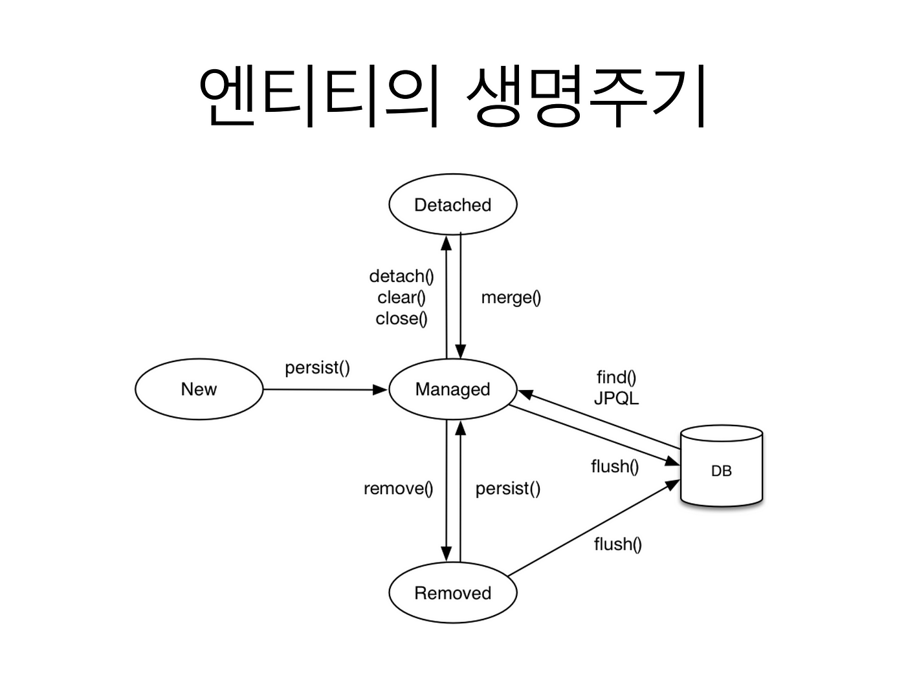

# 02. Repository 만드는 여러 방법 - JPQL 또는 @Query 어노테이션 그리고, EntityManager 등 활용

<br>

## 02-1. JPQL(Java Persistence Query Language) Query Method

Spring Boot JPA 에서는 JpaRepository 를 상속한 Repository를 작성하게 되면, JPQL을 기본적으로 활성화하여 사용할 수 있습니다.
JPQL(Java Persistence Query Language)이란? 정해진 문법(Rule)에 맞추어 메소드 이름을 지정만 하면, 해당 SQL 구문이 자동 생성될 수 있도록 되어 있습니다.

<br>

### 02-1-1. 규정된 메소드이름 규칙

- [규정된 메소드이름 규칙 참조 문서](https://docs.spring.io/spring-data/jpa/reference/jpa/query-methods.html "Query Method Rule")

| 메소드 구성 키워드 | 샘플 | 적용되는 SQL |
|------------|---------------------------------------|-----------------------------------------------|
| Distinct | findDistinctByLastnameAndFirstname | select distinct …​ where x.lastname = ?1 and x.firstname = ?2 |
| And | findByLastnameAndFirstname | … where x.lastname = ?1 and x.firstname = ?2 |
| Or | findByLastnameOrFirstname | … where x.lastname = ?1 or x.firstname = ?2 |
| Is, Equals | findByFirstname,findByFirstnameIs,findByFirstnameEquals | … where x.firstname = ?1 |
| Between | findByStartDateBetween | … where x.startDate between ?1 and ?2 |
| LessThan | findByAgeLessThan | … where x.age < ?1 |
| LessThanEqual | findByAgeLessThanEqual | … where x.age <= ?1 |
| GreaterThan | findByAgeGreaterThan | … where x.age > ?1 |
| GreaterThanEqual | findByAgeGreaterThanEqual | … where x.age >= ?1 |
| After | findByStartDateAfter | … where x.startDate > ?1 |
| Before | findByStartDateBefore | … where x.startDate < ?1 |
| IsNull, Null | findByAge(Is)Null | … where x.age is null |
| IsNotNull, NotNull | findByAge(Is)NotNull | … where x.age not null |
| Like | findByFirstnameLike | … where x.firstname like ?1 |
| NotLike | findByFirstnameNotLike | … where x.firstname not like ?1 |
| StartingWith | findByFirstnameStartingWith | … where x.firstname like ?1 (parameter bound with appended %) |
| EndingWith | findByFirstnameEndingWith | … where x.firstname like ?1 (parameter bound with prepended %) |
| Containing | findByFirstnameContaining | … where x.firstname like ?1 (parameter bound wrapped in %) |
| OrderBy | findByAgeOrderByLastnameDesc | … where x.age = ?1 order by x.lastname desc |
| Not | findByLastnameNot | … where x.lastname <> ?1 |
| In | findByAgeIn(Collection<Age> ages) | … where x.age in ?1 |
| NotIn | findByAgeNotIn(Collection<Age> ages) | … where x.age not in ?1 |
| True | findByActiveTrue() | … where x.active = true |
| False | findByActiveFalse() | … where x.active = false |
| IgnoreCase | findByFirstnameIgnoreCase | … where UPPER(x.firstname) = UPPER(?1) |

<br>

### 02-1-2. 메소드이름 규칙 예시

- 기본 규칙 : 기능종류+객체명+By+필드명

| 메소드 규칙 | 메소드 예시 | 메소드 설명 |
|------------|----------------------------------------|-------------------------------------------------------------------|
| find..By | Optional<Goods> findByNumber(Long number);  | 해당 테이블에서 기본키인 Number 를 기준으로 매개변수로 입력된 number 해당하는 엔티티를 반환합니다. |
| find..By | List<Goods> findAllByName(String name); | 해당 테이블에서 입력 되어진 name 값이 일치하는 Goods의 ResultSet 을 목록으로 반환합니다. |
| exists..By | boolean existsByNumber(Long number); | 해당 테이블에서 매개변수로 입력된 number에 해당하는 엔티티가 존재하는지 여부를 반환합니다. |
| count..By | long countByName(String name); | 해당 테이블에서 매개변수로 입력된 name에 해당하는 엔티티의 개수를 반환합니다. |
| delete..By | void deleteByNumber(Long number); | 해당 테이블에서 매개변수로 입력된 number에 해당하는 엔티티를 제거합니다. |
| remove..By | long removeByName(String name); | 해당 테이블에서 매개변수로 입력된 name에 해당하는 엔티티를 제거하고, 제거된 엔티티의 수를 반환합니다. |
| …First<number>… | List<Goods> findFirst5ByName(String name); | 해당 테이블에서 매개변수로 입력된 name에 해당하는 엔티티 중에서 처음부터 5개 이내의 목록을 반환합니다. |
| …Top<number>… | List<Goods> findTop10ByName(String name); | 해당 테이블에서 매개변수로 입력된 name에 해당하는 엔티티 중에서 먼저 검색된 10개 이내의 목록을 반환합니다. |
| …Is | Goods findByNumberIs(Long number); | 해당 테이블에서 매개변수로 입력된 number에 해당하는 엔티티를 반환합니다. |
| …Equals | Goods findByNumberEquals(Long number); | 해당 테이블에서 매개변수로 입력된 number에 해당하는 엔티티를 반환합니다. |
| …Null | List<Goods> findByPriceNull(); | 해당 테이블에서 Price 컬럼이 Null 값인 엔티티의 목록을 반환합니다. |
| …IsNull | List<Goods> findByPriceIsNull(); | 해당 테이블에서 Price 컬럼이 Null 값인 엔티티의 목록을 반환합니다. |
| …NotNull | List<Goods> findByPriceNotNull(); | 해당 테이블에서 Price 컬럼이 Null 값이 아닌 엔티티의 목록을 반환합니다. |
| …IsNotNull | List<Goods> findByPriceIsNotNull(); | 해당 테이블에서 Price 컬럼이 Null 값이 아닌 엔티티의 목록을 반환합니다. |
| …And… | Goods findByNumberAndName(Long number, String name); | 해당 테이블에서 매개변수로 입력된 number와 name이 모두 만족하는 엔티티를 반환합니다. |
| …Or… | Goods findByNumberOrName(Long number, String name); | 해당 테이블에서 매개변수로 입력된 number와 name이 어느 하나라도 만족하는 엔티티를 반환합니다. |
| …GreaterThan | List<Goods> findByPriceGreaterThan(Long price); | 해당 테이블에서 매개변수로 입력된 price 보다 큰 엔티티 목록을 반환합니다. |
| …LessThan | List<Goods> findByPriceLessThan(Long price); | 해당 테이블에서 매개변수로 입력된 price 보다 작은 엔티티 목록을 반환합니다. |
| …Between | List<Goods> findByPriceBetween(Long price1, Long price2); | 해당 테이블에서 매개변수로 입력된 price1 부터 price2 까지에 해당하는 엔티티 목록을 반환합니다. |
| …Like | List<Goods> findByNameLike(String name); | 해당 테이블에서 매개변수로 입력된 name이 포함되는 엔티티 목록을 반환합니다. |
| …Contains | List<Goods> findByNameContains(String name); | 해당 테이블에서 매개변수로 입력된 name이 포함되는 엔티티 목록을 반환합니다. |
| …StartsWith | List<Goods> findByNameStartsWith(String name); | 해당 테이블에서 매개변수로 입력된 name으로 시작하는 엔티티 목록을 반환합니다. |
| …EndsWith | List<Goods> findByNameEndsWith(String name); | 해당 테이블에서 매개변수로 입력된 name으로 끝나는 엔티티 목록을 반환합니다. |
| …OrderBy…Asc | List<Goods> findByNameOrderByNumberAsc(String name); | 해당 테이블에서 매개변수로 입력된 name 과 일치하는 엔티티를 목록으로 반환하되, <br>number 컬럼을 기준으로 오름차순 정렬하여 반환합니다. |
| …OrderBy…Desc | List<Goods> findByNameOrderByNumberDesc(String name); | 해당 테이블에서 매개변수로 입력된 name 과 일치하는 엔티티를 목록으로 반환하되, <br>number 컬럼을 기준으로 내림차순 정렬하여 반환합니다. |

<br>

### 02-1-3. JPQL 예시

```java
package com.datajpa.repository;

import com.datajpa.entity.Product;
import org.springframework.data.jpa.repository.JpaRepository;
import org.springframework.data.domain.Sort;
import org.springframework.data.jpa.repository.Query;
import org.springframework.data.repository.query.Param;

import java.util.List;
import java.util.Optional;

public interface ProductRepository extends JpaRepository<Product, Long> {

    /* 1. JPQL 사용하기 : 정해진 규칙에 의하여 메소드이름과 매개변수 그리고 반환타입을 지정하면, 해당 SQL로 변환한다. */
    // find..By
    Optional<Product> findByNumber(Long number);
    List<Product> findAllByName(String name);

    // exists..By
    boolean existsByNumber(Long number);

    // count..By
    long countByName(String name);

    // delete..By, remove..By
    void deleteByNumber(Long number);
    long removeByName(String name);

    // …First<number>…, …Top<number>…
    List<Product> findFirst5ByName(String name);
    List<Product> findTop10ByName(String name);

    /* 쿼리 메소드의 조건자 키워드 */
    Product findByNumberIs(Long number);   // Is, Equals => Logical Keyword : IS , Keyword Expressions : Is, Equals, (or no keyword) => findByNumber 메소드와 동일하게 동작
    Product findByNumberEquals(Long number);

    Product findByNumberIsNot(Long number);         // (Is)Not
    Product findByNumberNot(Long number);

    List<Product> findByUpdatedAtNull();        // (Is)Null, (Is)NotNull
    List<Product> findByUpdatedAtIsNull();
    List<Product> findByUpdatedAtNotNull();
    List<Product> findByUpdatedAtIsNotNull();

    Product findByNumberAndName(Long number, String name);          // And, Or
    Product findByNumberOrName(Long number, String name);

    List<Product> findByPriceIsGreaterThan(Long price);             // (Is)GreaterThan, (Is)LessThan, (Is)Between
    List<Product> findByPriceGreaterThan(Long price);
    List<Product> findByPriceGreaterThanEqual(Long price);
    List<Product> findByPriceIsLessThan(Long price);
    List<Product> findByPriceLessThan(Long price);
    List<Product> findByPriceLessThanEqual(Long price);
    List<Product> findByPriceIsBetween(Long lowPrice, Long highPrice);
    List<Product> findByPriceBetween(Long lowPrice, Long highPrice);

    List<Product> findByNameLike(String name);      // (Is)Like, (Is)Containing, (Is)StartingWith, (Is)EndingWith
    List<Product> findByNameIsLike(String name);

    List<Product> findByNameContains(String name);
    List<Product> findByNameContaining(String name);
    List<Product> findByNameIsContaining(String name);

    List<Product> findByNameStartsWith(String name);
    List<Product> findByNameStartingWith(String name);
    List<Product> findByNameIsStartingWith(String name);

    List<Product> findByNameEndsWith(String name);
    List<Product> findByNameEndingWith(String name);
    List<Product> findByNameIsEndingWith(String name);

    /* 정렬 처리하기 */
    List<Product> findByNameOrderByNumberAsc(String name);          // Asc : 오름차순, Desc : 내림차순
    List<Product> findByNameOrderByNumberDesc(String name);

    List<Product> findByNameOrderByPriceAscStockDesc(String name);      // 여러 정렬 기준 사용하기, And를 붙이지 않음

    List<Product> findByName(String name, Sort sort);       // 매개변수를 활용한 정렬 방법
}
```

<br><hr><br>

## 02-2. @Query 어노테이션

Spring Boot JPA(Java Persistence API)를 사용하여 Repository를 구성하다 보면 Query Methods 만으로 원하는 SQL 처리가 불가능한 경우 Repository의 메소드를 기술하면서 
해당 메소드 상단부에 @Query("Persistence Context SQL Sentence") 형식으로 기술하여 나타낼 수 있습니다. 이러한 방법은 두 가지로 기술됩니다. 우선, JPQL Query를 사용하는 경우가 있고, 나머지는 Native Query 를 사용하여 정의하는 경우가 있습니다.

<br>

### 02-2-1. JPQL Query

#### 문법 

```comment
@Query("Java Persistence Context SQL Sentence")
public 반환타입 메소드명(매개타입 매개변수);
```

- 위 문법과 같이 SQL Sentence 에는 해당 테이블명 뒤에 별칭(Alias)를 기술하여야 합니다.
- SQL Sentence 상의 매개변수명을 활용할 경우는 매개변수 앞에 @Param("매개변수명")를 붙이고, SQL Sentence 내에 :매개변수명 을 적습니다.
- 매개변수의 @Param("매개변수명")을 생략하는 경우는 메소드의 매개변수명을 열거하고, SQL Sentence 내에 ? 뒤에 ?매개변수순번 을 적습니다.

<br>

```java
package com.datajpa.repository;

import com.datajpa.entity.Producer;
import org.springframework.data.jpa.repository.JpaRepository;
import org.springframework.data.jpa.repository.Modifying;
import org.springframework.data.jpa.repository.Query;
import org.springframework.data.repository.query.Param;
import org.springframework.transaction.annotation.Transactional;

import java.util.List;

public interface ProducerRepository1 extends JpaRepository<Producer, Long> {
    @Query("SELECT p FROM Producer p WHERE p.name = ?1")
    List<Producer> findByName(String name);    //위 ?숫자는 매개변수의 순번입니다.

    @Query("SELECT p FROM Producer p WHERE p.name = :name")
    List<Producer> findByNameParam(@Param("name") String name); //:의 뒤에 붙는 것은 @Param("매개변수명") 에서 나타낸 매개변수명입니다.

    @Query("SELECT p.code, p.name, p.email FROM Producer p WHERE p.name = :name")
    List<Object[]> findByNameParam2(@Param("name") String name);    

    @Transactional
    @Modifying
    @Query("update Producer p set p.code = ?2, p.name = ?3, p.email = ?4 where p.id = ?1")
    void updateAllById(Long id, String code, String name, String email);    //위 ?숫자는 매개변수의 순번입니다.

    @Transactional
    @Modifying
    @Query("delete from Producer p where p.id = ?1")
    void deleteAllById(Long id);
}
```

<br>

### 02-2-2. Native Query

<br>

#### 문법 

```comment
@Query(value = "SQL Sentence", nativeQuery = true)
public 반환타입 메소드명(매개타입 매개변수);
```

- 위 문법과 같이 SQL Sentence 에는 별칭(Alias)을 사용하지 않고, 일반 SQL 문법에 따라 기술하여야 합니다.
- SQL Sentence 상의 매개변수명을 활용할 경우는 매개변수 앞에 @Param("매개변수명")를 붙이고, SQL Sentence 내에 :매개변수명 을 적습니다.
- 매개변수의 @Param("매개변수명")을 생략하는 경우는 메소드의 매개변수명을 열거하고, SQL Sentence 내에 ? 뒤에 ?매개변수순번 을 적습니다.

<br>


```java
package com.datajpa.repository;

import com.datajpa.entity.Producer;
import org.springframework.data.jpa.repository.JpaRepository;
import org.springframework.data.jpa.repository.Modifying;
import org.springframework.data.jpa.repository.Query;
import org.springframework.data.repository.query.Param;
import org.springframework.transaction.annotation.Transactional;

import java.util.List;

public interface ProducerRepository2 extends JpaRepository<Producer, Long> {
    @Query(value = "SELECT * FROM Producer WHERE name = ?1", nativeQuery = true)
    List<Producer> findByName(String name);

    @Query(value = "SELECT * FROM Producer WHERE name = :name", nativeQuery = true)
    List<Producer> findByNameParam(@Param("name") String name);

    @Query(value = "SELECT code, name, email FROM Producer WHERE name = :name", nativeQuery = true)
    List<Object[]> findByNameParam2(@Param("name") String name);

    @Transactional
    @Modifying
    @Query(value = "update Producer set code = ?2, name = ?3, email = ?4 where id = ?1", nativeQuery = true)
    void updateAllById(Long id, String code, String name, String email);

    @Transactional
    @Modifying
    @Query(value = "delete from Producer where id = ?1", nativeQuery = true)
    void deleteAllById(Long id);

    @Transactional
    @Modifying
    @Query(value = "insert into producer(code, name, email) values (?1, ?2, ?3)", nativeQuery = true)
    void saveAllBy(String code, String name, String email);
}
```

<br>

### 02-2-2. @Query 어노테이션 사용 예시

```java
package com.datajpa.repository;

import com.datajpa.entity.Producer;
import org.springframework.data.jpa.repository.JpaRepository;
import org.springframework.data.jpa.repository.Modifying;
import org.springframework.data.jpa.repository.Query;
import org.springframework.data.repository.query.Param;
import org.springframework.transaction.annotation.Transactional;

import java.util.List;

public interface ProducerRepository extends JpaRepository<Producer, Long> {
    @Query("SELECT p FROM Producer p WHERE p.name = ?1")
    List<Producer> findByName(String name);

    @Query("SELECT p FROM Producer p WHERE p.name = :name")
    List<Producer> findByNameParam(@Param("name") String name);

    @Query("SELECT p.code, p.name, p.email FROM Producer p WHERE p.name = :name")
    List<Object[]> findByNameParam2(@Param("name") String name);

    @Transactional
    @Modifying
    @Query("update Producer p set p.code = ?2, p.name = ?3, p.email = ?4 where p.id = ?1")
    void updateAllById(Long id, String code, String name, String email);

    @Transactional
    @Modifying
    @Query("delete from Producer p where p.id = ?1")
    void deleteAllById(Long id);

    @Transactional
    @Modifying
    @Query(value = "insert into producer(code, name, email) values (?1, ?2, ?3)", nativeQuery = true)
    void saveAllBy(String code, String name, String email);
}
```

<br><hr><br>

## 02-3. EntityManager

EntityManager 는 말 그대로 Entity(엔티티)를 관리하는데 그 목적이 있습니다. 다른 MyBatis나 @Query 어노테이션 처럼 SQL 구문을 직접 작성하는 것이 아니라,
기본 동작인 CRUD(Create, Read, Update, Delete) 등이 될 수 있도록 해당 메소드를 지원하는 인터페이스로서 JpaRepository를 활용하지 않으면서, Persistence Context 를 활용하여
Entity 의 상태에 따라 데이터베이스를 운영하는 인터페이스입니다.

<br>

### 02-3-1. EntityManager 의 영속성 컨텍스트(Persistence Context)

엔티티를 영구 저장하는 환경으로 자바 영역에서 데이터를 관리하여 데이터베이스 접근을 최적화하는 역할을 담당합니다.

```java
    @PersistenceContext
    private EntityManager entityManager;
```

<br>

#### 영속성 컨텍스트(Persistence Context)의 생명주기

- 비영속(New) : 영속성 컨텍스트와 연관이 없는 상태
- 영속(Managed) : 영속성 컨텍스트에서 관리 중인 상태
- 준영속(Detached) : 영속성 컨텍스트에 저장되어 있었으나 분리된 상태
- 삭제(Removed) : 영속성 컨텍스트에서 완전히 삭제된 상태

<br>

#### 영속성 컨텍스트(Persistence Context)의 상태변화와 데이터베이스 처리



※ New(비영속), Managed(영속), Detached(준영속), Removed(삭제) 등 4가지 상태

- Insert 동작 : New(비영속) -> entityManager.persist(goods) -> Managed(영속)

- Upadate 동작 : Managed(영속) -> entityManager.detach(goods) -> Detached(준영속) -> entityManager.merge(goods) -> Managed(영속)

- Delete 동작 : Managed(영속) -> entityManager.remove(goods) -> Removed(삭제)

- Select 동작 : 상태변화가 없으며, entityManager.find(Xxxx.class, id) 로 검색결과를 반환

<br>

### 02-3-2. EntityManager 의 관련 메소드

| 메소드명 | 반환값 | 설명 |
|---------------------|----------|----------------------------------------------------------------|
| clear() | void | 모든 엔티티의 내용을 비웁니다. |
| close() | void | 엔티티매니저를 닫습니다. |
| contains(Object entity) | boolean | 해당 객체가 엔티티에 존재하는지 확인합니다. |
| createEntityGraph(Class<T> rootType) | <T> EntityGraph<T> | EntityGraph를 동적으로 생성하는 데 사용할 수 있는 변경 가능한 EntityGraph를 반환합니다. |
| createEntityGraph(String graphName) | EntityGraph<?> | 명명된 EntityGraph의 변경 가능한 복사본을 반환합니다. |
| createNamedQuery(String name) | Query | 명명된 쿼리를 실행하기 위한 쿼리 자바 객체를 만듭니다 |
| createNamedQuery(String name, Class<T> resultClass) | <T> TypedQuery<T> | query라는 Java Persistence 쿼리 언어를 실행하기 위한 TypedQuery 자바 객체를 만듭니다. |
| createNamedStoredProcedureQuery(String name) | StoredProcedureQuery | 데이터베이스에서 저장 프로시저를 실행하기 위한 StoredProcedureQuery 자바 객체를 만듭니다. |
| createNativeQuery(String sqlString) | Query | 업데이트 또는 삭제와 같은 기본 SQL 문을 실행하기 위한 쿼리 자바 객체를 만듭니다. findAll 동작시 활용됨. |
| createNativeQuery(String sqlString, Class resultClass) | Query | 기본 SQL 쿼리를 실행하기 위한 쿼리 자바 객체를 만듭니다. |
| createNativeQuery(String sqlString, String resultSetMapping) | Query |  기본 SQL 쿼리를 실행하기 위한 쿼리 자바 객체를 만듭니다. |
| createQuery(CriteriaDelete deleteQuery) | Query | 기본 삭제 쿼리를 실행하기 위한 쿼리 자바 객체를 만듭니다. |
| createQuery(CriteriaQuery<T> criteriaQuery) | <T> TypedQuery<T> | 기본 쿼리를 실행하기 위한 TypedQuery 자바 객체를 만듭니다. |
| createQuery(CriteriaUpdate updateQuery) | Query | 기본 업데이트 쿼리를 실행하기 위한 쿼리 자바 객체를 만듭니다. |
| createQuery(String qlString) | Query | Java Persistence 쿼리 언어 문을 실행하기 위한 쿼리 자바 객체를 만듭니다. |
| createQuery(String qlString, Class<T> resultClass) | <T> TypedQuery<T> | Java Persistence 쿼리 언어 문을 실행하기 위한 TypedQuery 자바 객체를 만듭니다. |
| createStoredProcedureQuery(String procedureName) | StoredProcedureQuery | 데이터베이스에서 저장 프로시저를 실행하기 위한 StoredProcedureQuery 자바 객체를 만듭니다. |
| detach(Object entity) | void | 제거된 엔티티에 대하여 비활성화합니다. |
| find(Class<T> entityClass, Object primaryKey) | <T> T | 해당 테이블과 기본키 컬럼을 지정하여 하나의 해당 엔티티를 검색합니다. find 동작시 활용됨. |
| flush() | void | 현재 엔티티 정보들인 Persistence Context 의 내용을 실제 데이터베이스에 동기화 시킵니다. |
| getCriteriaBuilder() | CriteriaBuilder | CriteriaQuery 객체 생성을 위한 CriteriaBuilder 자바 객체를 반환합니다. |
| getDelegate() | Object | 가능한 경우 EntityManager에 대한 기본 공급자 개체를 반환합니다. |
| getEntityGraph(String graphName) | EntityGraph<?> | 지정한 해당 EntityGraph를 반환합니다. |
| getEntityManagerFactory() | EntityManagerFactory | 현재 사용 중인 EntityManagerFactory를 반환합니다. |
| getFlushMode() | FlushModeType | 모든 개체에 적용되는 플러시 모드를 가져옵니다. |
| getProperties() | Map<String,Object> | 현재 사용 중인 EntityManager에 적용된 속성, 힌트 및 관련 값을 가져옵니다. |
| getReference(Class<T> entityClass, Object primaryKey) | <T> T | 상태를 느리게 가져올 수 있는 자바 객체를 가져옵니다. |
| getTransaction() | EntityTransaction | 리소스 수준 EntityTransaction 개체를 반환합니다. |
| isJoinedToTransaction() | boolean | 현재 트랜잭션에 조인되어 있는지 확인합니다. |
| isOpen() | boolean | Entity Manager가 열려 있는지 확인합니다. |
| joinTransaction() | void | JTA 트랜잭션이 활성 상태임을 Entity Manager에게 알리고 Persistence Context를 이에 결합합니다. |
| merge(T entity) | <T> T | 주어진 엔터티의 상태를 현재 Persistence Context에 병합하여 적용합니다. Update 작업시 활용됨. |
| persist(Object entity) | void | 자바 객체의 정보를 현재 Persistence Context에 추가합니다. Insert 작업시 활용됨. |
| refresh(Object entity) | void | 데이터베이스에서 인스턴스 상태를 새로 고치고 엔터티에 대한 변경 사항이 있으면 덮어씁니다. |
| remove(Object entity) | void | 지정한 엔티티를 테이블에서 제거합니다. delete 적업시 주로 사용함. |
| setProperty(String propertyName, Object value) | void | Entity Manager 의 속성 또는 힌트를 설정합니다. |
| unwrap(Class<T> cls) | <T> T | 공급자별 API에 대한 액세스를 허용하려면 지정된 유형의 개체를 반환합니다. |

<br>

### 02-3-3. EntityManager 의 사용 예시

```java
package com.datajpa.repository;

import com.datajpa.entity.Category;
import jakarta.persistence.*;
import lombok.RequiredArgsConstructor;
import org.springframework.stereotype.Repository;
import org.springframework.transaction.annotation.Transactional;

import java.util.List;

@Repository
@RequiredArgsConstructor
public class CategoryRepository {

    @PersistenceContext
    private EntityManager entityManager;

    public List<Category> findAll() {
        return entityManager.createQuery("select c from Category c", Category.class).getResultList();
    }

    public Category findOne(Long id){
        return entityManager.find(Category.class, id);
    }

    public void save(Category cate) {
        entityManager.persist(cate);
    }

    public void modify(Category cate) {
        entityManager.detach(cate);
        entityManager.merge(cate);
    }

    public void remove(Category cate) {
        entityManager.remove(cate);
    }
}
```